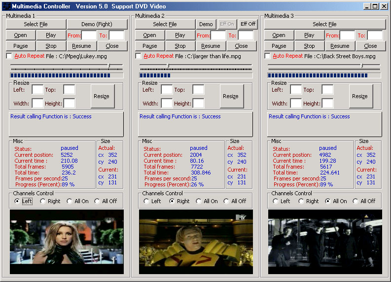



## Forget Controls MultiMedia\.     Now By API Version 5\.0

### Description

Hi everybody,

Are you sure wanna player for All Multimedia files

and make about more than 20 Control for Multimedia file just by Windows pure API.

Okay.(Now version 5.0 with Channels Audio)
 
### More Info
 

             |
---                |---
**Submitted On**   |2000-08-15 06:10:30
**By**             |[Abdullah Al\-Ahdal](https://github.com/Planet-Source-Code/PSCIndex/blob/master/ByAuthor/abdullah-al-ahdal.md)
**Level**          |Beginner
**User Rating**    |5.0 (25 globes from 5 users)
**Compatibility**  |VB 5\.0, VB 6\.0
**Category**       |[Sound/MP3](https://github.com/Planet-Source-Code/PSCIndex/blob/master/ByCategory/sound-mp3__1-45.md)
**World**          |[Visual Basic](https://github.com/Planet-Source-Code/PSCIndex/blob/master/ByWorld/visual-basic.md)
**Archive File**   |[CODE\_UPLOAD89878152000\.zip](https://github.com/Planet-Source-Code/abdullah-al-ahdal-forget-controls-multimedia-now-by-api-version-5-0__1-10628/archive/master.zip)

### Source Code

<HTML>
<HEAD>
<META NAME="GENERATOR" Content="Microsoft Visual Studio 6.0">
<TITLE></TITLE>
</HEAD>
<BODY>

Hello Members planet source code.

  Now Version 5.0 not Update
IIII.

Are you search for Player for All Multimedia Files including mp3,mpg..etc just via PURE windows API (no any OCXs)
.

What new in this version?

1-In this version there were common
errors in Windows 2000 was repaired (now the code useful for win2000).

2-I added Function for Channels Audio
Control.

you can here
play on Left channel audio file and on right channel another audio file at the
same time Or:

play the file
two times at the same time one on the left and the another on the right.

    

And also make the following controls just via API:

1-Open most multimmedia files. 2-Playing it

3-Pause it

4- Stop it

5-Resume it

6-Close it

7-Get Current position(current frame)

8-Get current time

9-Get Percent of playing file

10-make it auto Repeat

11-Get Total frames

12- Get Total Time

13-Get the Status of file if it "playing or stopped or
paused"

14-Get actual size
(new).

15-Get current size
(new).

16-Resize the movie.

17-Get number frames per second

18-let you know if multimedia at the end
now

<A
href="http://www.planet-source-code.com/vb/scripts/ShowCode.asp?lngWId=1&txtCodeId=9783">http://www.planet-source-code.com/vb/scripts/ShowCode.asp?lngWId=1&txtCodeId=9783</A>

(there are Module for Standard use and has
ready functions)

Written once to use it every time.

Enjoy to Make your own
Player.

</BODY>
</HTML>

